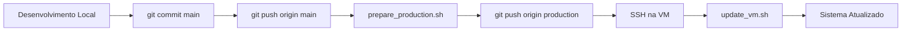

# 📦 Sistema Ki Aikido - Preparado para Deploy em Google VM

## ✅ Status: Sistema preparado para produção

O sistema foi configurado com todos os scripts e documentação necessários para deploy em Google Cloud VM via SSH.

---

## 📁 Arquivos Criados

### 📋 Documentação

1. **DEPLOY_QUICKSTART.md** - Guia rápido de deploy (início rápido)
2. **DEPLOY_CHECKLIST.md** - Checklist completo de deploy e manutenção
3. **docs/DEPLOY_GOOGLE_VM.md** - Documentação técnica completa
4. **scripts/deploy/README.md** - Documentação dos scripts de deploy

### 🔧 Scripts de Deploy (scripts/deploy/)

1. **install_vm.sh** - Instalação inicial na VM
2. **update_vm.sh** - Atualização/deploy de novas versões
3. **backup_db.sh** - Backup manual do banco de dados
4. **restore_db.sh** - Restauração de backup
5. **check_health.sh** - Verificação de saúde do sistema
6. **prepare_production.sh** - Preparar código local para produção
7. **setup_auto_backup.sh** - Configurar backup automático (cron)

### ⚙️ Arquivos de Configuração

1. **scripts/deploy/nginx.conf** - Configuração Nginx (proxy reverso + arquivos estáticos)
2. **scripts/deploy/supervisor.conf** - Configuração Supervisor (gerenciamento de processos)
3. **.env.production.example** - Exemplo de configuração de ambiente

### 📝 Outros

1. **.gitignore** - Atualizado para incluir backups e cookies
2. **README.md** - Atualizado com seção de deploy

---

## 🏗️ Arquitetura de Produção

```
Internet (porta 80/443)
         ↓
    Nginx (proxy reverso)
         ↓
    ┌─────────────────────┐
    │  Frontend           │
    │  (arquivos estáticos)│
    └─────────────────────┘
         ↓
    Backend Flask (porta 5000)
    gerenciado por Supervisor
         ↓
    SQLite Database
         ↓
    Backups automáticos (cron)
```

---

## 🚀 Como Fazer o Deploy

### Primeira Vez (Setup Inicial)

#### 1. Na sua máquina local:
```bash
# Preparar branch production
./scripts/deploy/prepare_production.sh
```

#### 2. Na Google VM (via SSH):
```bash
# Instalar dependências
sudo apt update && sudo apt upgrade -y
sudo apt install -y python3 python3-pip python3-venv git nginx supervisor sqlite3

# Clonar repositório (branch production)
sudo mkdir -p /opt/ki-aikido-system
sudo chown $USER:$USER /opt/ki-aikido-system
cd /opt/ki-aikido-system
git clone -b production [URL_DO_SEU_REPO] .

# Instalar aplicação
chmod +x scripts/deploy/*.sh
./scripts/deploy/install_vm.sh

# Configurar Nginx
sudo cp scripts/deploy/nginx.conf /etc/nginx/sites-available/ki-aikido
sudo ln -s /etc/nginx/sites-available/ki-aikido /etc/nginx/sites-enabled/
sudo rm -f /etc/nginx/sites-enabled/default
sudo nginx -t && sudo systemctl restart nginx

# Configurar Supervisor
sudo cp scripts/deploy/supervisor.conf /etc/supervisor/conf.d/ki-aikido.conf
sudo supervisorctl reread && sudo supervisorctl update
sudo supervisorctl start ki-aikido

# Verificar
./scripts/deploy/check_health.sh
```

#### 3. Acessar sistema:
```
http://[IP_EXTERNO_DA_VM]
```

### Atualizações (Deploys Subsequentes)

#### 1. Na sua máquina local:
```bash
# Desenvolver no branch main
git add .
git commit -m "Descrição das alterações"
git push origin main

# Preparar para produção
./scripts/deploy/prepare_production.sh
```

#### 2. Na VM:
```bash
cd /opt/ki-aikido-system
./scripts/deploy/update_vm.sh
```

**Pronto!** O sistema será atualizado automaticamente.

---

## 🔐 Segurança - IMPORTANTE

### Após Primeiro Deploy:

1. **Alterar SECRET_KEY** em `/opt/ki-aikido-system/backend/src/main.py`:
```python
# Gerar nova chave
python3 -c "import secrets; print(secrets.token_hex(32))"

# Substituir em main.py
app.config['SECRET_KEY'] = 'chave-gerada-aqui'
```

2. **Alterar senha do admin**:
   - Login: `admin@kiaikido.com`
   - Senha padrão: `123456`
   - Ir em Configurações → Alterar Senha

3. **Configurar HTTPS** (recomendado):
```bash
sudo apt install -y certbot python3-certbot-nginx
sudo certbot --nginx -d seu-dominio.com
```

---

## 📊 Monitoramento e Manutenção

### Comandos Úteis

```bash
# Status da aplicação
sudo supervisorctl status ki-aikido

# Ver logs em tempo real
tail -f /opt/ki-aikido-system/logs/app.log
tail -f /opt/ki-aikido-system/logs/error.log

# Reiniciar aplicação
sudo supervisorctl restart ki-aikido

# Verificar saúde do sistema
./scripts/deploy/check_health.sh

# Backup manual
./scripts/deploy/backup_db.sh

# Configurar backup automático (3h da manhã)
./scripts/deploy/setup_auto_backup.sh
```

### Logs Importantes

- **App**: `/opt/ki-aikido-system/logs/app.log`
- **Erros**: `/opt/ki-aikido-system/logs/error.log`
- **Nginx Access**: `/var/log/nginx/ki-aikido-access.log`
- **Nginx Error**: `/var/log/nginx/ki-aikido-error.log`
- **Supervisor**: `/var/log/supervisor/supervisord.log`

---

## 🌐 Configuração de Firewall (Google Cloud)

No Console do Google Cloud:

1. **VPC Network** → **Firewall** → **Create Firewall Rule**
2. Criar regra para HTTP:
   - Nome: `allow-http-ki-aikido`
   - Targets: Specified target tags
   - Target tags: `http-server`
   - Source IP ranges: `0.0.0.0/0`
   - Protocols and ports: `tcp:80`

3. Adicionar tag `http-server` à instância VM

---

## 📚 Documentação Disponível

### Para Começar
- **DEPLOY_QUICKSTART.md** - Guia rápido (comece aqui!)
- **DEPLOY_CHECKLIST.md** - Checklist passo a passo

### Documentação Técnica
- **docs/DEPLOY_GOOGLE_VM.md** - Guia completo e detalhado
- **scripts/deploy/README.md** - Referência de scripts
- **docs/API.md** - Documentação da API

---

## 🔄 Workflow: Desenvolvimento → Produção



**Resumo:**
1. Desenvolver no branch `main`
2. Executar `./scripts/deploy/prepare_production.sh`
3. Na VM: `./scripts/deploy/update_vm.sh`

---

## ✨ Recursos do Sistema de Deploy

### Automatização
✅ Backup automático antes de cada deploy  
✅ Validação de código Python  
✅ Reinicialização automática da aplicação  
✅ Verificação de saúde pós-deploy  
✅ Rollback em caso de erro  

### Segurança
✅ Separação de ambientes (main vs production)  
✅ Configuração de HTTPS via Certbot  
✅ Arquivo .env para configurações sensíveis  
✅ Proxy reverso Nginx  
✅ Gerenciamento de processos com Supervisor  

### Manutenção
✅ Scripts de backup/restore  
✅ Logs centralizados  
✅ Verificação de saúde do sistema  
✅ Backup automático via cron  
✅ Rotação de logs  

---

## 🆘 Troubleshooting

### Aplicação não inicia
```bash
sudo supervisorctl tail -f ki-aikido stderr
cat /opt/ki-aikido-system/logs/error.log
```

### Erro 502 Bad Gateway
```bash
# Verificar se backend está rodando
curl http://localhost:5000/api/health
sudo supervisorctl status ki-aikido

# Ver logs
sudo tail -f /var/log/nginx/error.log
```

### Rollback
```bash
# Parar aplicação
sudo supervisorctl stop ki-aikido

# Voltar commit
cd /opt/ki-aikido-system
git reset --hard COMMIT_ANTERIOR

# Restaurar backup
./scripts/deploy/restore_db.sh backups/app_TIMESTAMP.db

# Reiniciar
sudo supervisorctl start ki-aikido
```

---

## 📞 Próximos Passos

1. ✅ **Revisar documentação** - Ler DEPLOY_QUICKSTART.md
2. ✅ **Preparar VM** - Criar VM no Google Cloud
3. ✅ **Executar deploy** - Seguir checklist
4. ✅ **Configurar segurança** - Alterar SECRET_KEY e senha admin
5. ✅ **Configurar HTTPS** - Instalar certificado SSL
6. ✅ **Testar sistema** - Validar todas funcionalidades
7. ✅ **Configurar backups** - setup_auto_backup.sh
8. ✅ **Monitorar** - Acompanhar logs e métricas

---

## 📝 Notas Importantes

- O branch **main** é para desenvolvimento
- O branch **production** é para ambiente ativo na VM
- Sempre fazer merge de main → production via `prepare_production.sh`
- Nunca commitar arquivos .env com valores reais
- Sempre fazer backup antes de alterações críticas
- Manter os últimos 30 backups (automático)
- Sistema usa SQLite (adequado para carga pequena/média)

---

## ✅ Checklist Final

- [ ] Todos os scripts criados e executáveis
- [ ] Documentação completa disponível
- [ ] .gitignore atualizado
- [ ] README.md atualizado com seção de deploy
- [ ] Configuração Nginx pronta
- [ ] Configuração Supervisor pronta
- [ ] Scripts de backup implementados
- [ ] Sistema de verificação de saúde pronto
- [ ] Workflow de deploy documentado

**Status: ✅ SISTEMA PRONTO PARA DEPLOY**

---

**Desenvolvido com ❤️ para a comunidade Ki Aikido Brasil**
